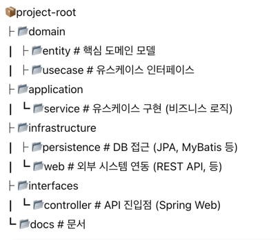

# 프로젝트 아키텍처 설명

## 🧭 프로젝트 개요

- 이 프로젝트는 TDD 기반의 콘서트 좌석 예약 시스템을 구현하는 과제입니다.  
- 도메인 복잡도와 기능 확장 가능성을 고려해 **클린 아키텍처(Clean Architecture)** 를 지향하여 설계했습니다.

---

## 🧱 아키텍처 구조 선택 이유

클린 아키텍처는 다음과 같은 이점을 제공합니다:

- **관심사의 분리 (Separation of Concerns)**  
  UI, 도메인, 인프라 로직을 계층별로 분리하여 유지보수 용이성 향상

- **의존성 역전 (Dependency Inversion)**  
  외부 프레임워크나 기술 스택에 종속되지 않고, 내부 비즈니스 로직을 중심으로 설계 가능

- **유연한 테스트 작성**  
  외부 시스템 없이도 도메인/애플리케이션 계층 단위 테스트 가능

- **확장성 & 유지보수성**  
  기능 추가 시 구조 변경 최소화, 팀 협업 시 분업이 쉬움

---

## 🏗️ 프로젝트 레이어 구조

---

## 🔁 레이어 간 의존성

- `controller → usecase interface`
- `service → domain`
- `infrastructure → usecase 구현 (빈 등록)`
- `domain ← 인터페이스만 의존, 외부 기술에 독립`

---

## 💡 설계 의도 및 결정

- **유스케이스를 interface로 분리**하여 테스트 및 유연한 구현 대체 가능성 확보
- 도메인 엔티티와 JPA 엔티티를 분리 → 순수 도메인 모델 보호
- `@Transactional`은 application layer에서만 사용 → 도메인 순수성 유지

---